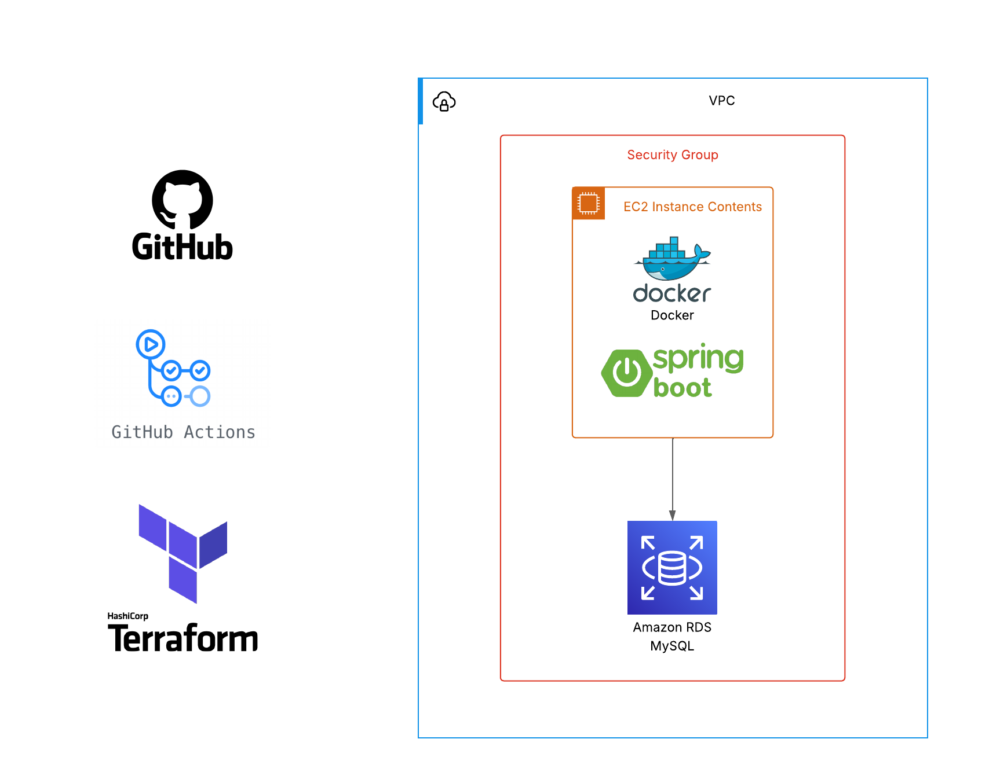

# nequi-techlead-challenge-ms

Microservicio de gestión de Franquicias, sucursales y productos como parte del desafío técnico para el rol de **Tech Lead** en Nequi.



Este servicio permite realizar operaciones CRUD sobre las siguientes entidades:

| Entidad Técnica | Significado en el Negocio |
| --------------- | ------------------------- |
| `Brand`         | Franquicia                |
| `Site`          | Sucursal                  |
| `Product`       | Producto                  |

## Arquitectura

Se implementó bajo el enfoque de Clean Architecture, utilizando el plugin [Scaffold Clean Arquitecture](https://bancolombia.github.io/scaffold-clean-architecture/docs/intro) de Bancolombia (Open Source), el cual permite estructurar el código de forma clara y mantenible, separando responsabilidades en capas bien definidas.


---

## 📦 Estructura del proyecto
```
📦nequi-techlead-challenge-ms
┣ 📂applications
┃ ┗ 📂app-service
┃ ┃ ┣ 📂src
┃ ┃ ┃ ┣ 📂main
┃ ┃ ┃ ┃ ┣ 📂java
┃ ┃ ┃ ┃ ┃ ┗ 📂co.com.nequi.techlead.challenge
┃ ┃ ┃ ┃ ┃ ┃ ┣ 📂config
┃ ┃ ┃ ┃ ┃ ┃ ┃ ┗ 📜[configs and beans]
┃ ┃ ┃ ┃ ┃ ┃ ┗ 📜MainApplication.java
┃ ┃ ┃ ┃ ┗ 📂resources
┃ ┃ ┃ ┃ ┃ ┣ 📜[properties]
┃ ┃ ┃ ┗ 📂test
┃ ┃ ┃ ┃ ┗ 📂java
┃ ┃ ┃ ┃ ┃ ┗ 📂co.com.nequi.techlead.challenge
┃ ┃ ┗ 📜build.gradle
┣ 📂deployment
┃ ┣ 📜[Dockerfile, Pipelines as a code]
┣ 📂domain
┃ ┣ 📂model
┃ ┃ ┣ 📂src
┃ ┃ ┃ ┣ 📂main
┃ ┃ ┃ ┃ ┗ 📂java
┃ ┃ ┃ ┃ ┃ ┗ 📂co.com.nequi.techlead.challenge
┃ ┃ ┃ ┗ 📂test
┃ ┃ ┃ ┃ ┗ 📂java
┃ ┃ ┃ ┃ ┃ ┗ 📂co.com.nequi.techlead.challenge
┃ ┃ ┗ 📜build.gradle
┃ ┗ 📂usecase
┃ ┃ ┣ 📂src
┃ ┃ ┃ ┣ 📂main
┃ ┃ ┃ ┃ ┗ 📂java
┃ ┃ ┃ ┃ ┃ ┗ 📂co.com.nequi.techlead.challenge
┃ ┃ ┃ ┗ 📂test
┃ ┃ ┃ ┃ ┗ 📂java
┃ ┃ ┃ ┃ ┃ ┗ 📂co.com.nequi.techlead.challenge
┃ ┃ ┃ ┃ ┃ ┃ ┗ 📂usecase
┃ ┃ ┗ 📜build.gradle
┣ 📂infrastructure
┃ ┣ 📂driven-adapters
┃ ┣ 📂entry-points
┃ ┗ 📂helpers
┣ 📜.gitignore
┣ 📜build.gradle
┣ 📜gradle.properties
┣ 📜lombok.config
┣ 📜main.gradle
┣ 📜README.md
┗ 📜settings.gradle
```

---

## 🚀 ¿Cómo ejecutar el proyecto localmente?

### 1. Clona el repositorio

```bash
git clone https://github.com/SeRoGra/nequi-techlead-challenge-ms.git
cd nequi-techlead-challenge-ms
```

### 2. Crea y levanta la base de datos con Docker

Asegúrate de tener Docker instalado. <br>
Luego ejecuta el siguiente comando para iniciar un contenedor de MySQL:
```bash
docker run --name mysql-nequi \
  -e MYSQL_ROOT_PASSWORD=my-secret-pw \
  -v /var/lib/mysql \
  -p 3306:3306 \
  -d mysql
```

Esto levanta una instancia de MySQL accesible en localhost:3306.

#### ⚙️ Ejecuta el script de creación de la base de datos <br>

Una vez el contenedor esté corriendo, ejecuta el script `nequi-techlead-challenge-db.sql` para crear el schema `nequi_techlead_challenge_db` y sus respectivas tablas:

```bash
docker exec -i mysql-nequi \
mysql -u root -pmy-secret-pw < ./nequi-techlead-challenge-db.sql
```

También puedes ejecutar el script manualmente utilizando **DBeaver** u otro cliente de base de datos. Solo necesitas conectarte a la instancia local de MySQL en Docker (`localhost:3306`), usando el usuario `root` y la contraseña `my-secret-pw`, y luego ejecutar el archivo `nequi-techlead-challenge-db.sql` para crear el esquema y las tablas necesarias.

---

### 3. Variables de entorno

Puedes usar variables en tiempo de ejecución o definir un archivo `.env`. Las propiedades necesarias están en `application.yml` y usan placeholders con valores por defecto:

```yaml
spring:
  datasource:
    url: ${MYSQL_URL:jdbc:mysql://localhost:3306/nequi_techlead_challenge_db?allowPublicKeyRetrieval=true&useSSL=false}
    username: ${MYSQL_USERNAME:root}
    password: ${MYSQL_PASSWORD:my-secret-pw}
```

#### Si deseas sobrescribirlas:

```bash
export MYSQL_URL=jdbc:mysql://localhost:3306/nequi_techlead_challenge_db
export MYSQL_USERNAME=root
export MYSQL_PASSWORD=my-secret-pw
```

---

### 4. Compila y ejecuta el proyecto

```bash
./gradlew clean build
./gradlew :app-service:bootRun
```
El servicio quedará expuesto en el puerto `8081`.

---

## 🔁 Endpoints expuestos

Si estás usando herramientas como **Postman** o **Bruno**, puedes importar directamente la colección `nequi-techlead-challenge-ms.postman.json` o `nequi-techlead-challenge-ms.bruno`.  
Estas colecciones incluyen todos los endpoints expuestos por el servicio, organizados por entidad (`Brand`, `Site` y `Product`) y con ejemplos preconfigurados de:

- Peticiones GET, POST, PUT y DELETE.
- Cuerpos de solicitud (`body`) listos para usar.
- Headers y parámetros necesarios para cada endpoint.

Esto te permitirá **probar rápidamente las funcionalidades** del microservicio sin necesidad de escribir manualmente las solicitudes.


### Brands (Franquicias)

✅ `GET /api/brands` → Listar todas las Franquicias <br>
✅`POST /api/brands` → Crear Franquicia `{ "name": "..." }` <br>
✅`PUT /api/brands/{brandId}` → Actualizar Franquicia <br>
❌ `DELETE /api/brands?onCascade=true|false` _#TODO_

### Sites (Sucursales)

✅`GET /api/brands/{brandId}/sites` → Listar sucursales por franquicia <br>
✅`POST /api/brands/{brandId}/sites` → Crear sucursal `{ "name": "..." }` <br>
✅`PUT /api/brands/{brandId}/sites/{siteId}` → Actualizar sucursal <br>
❌ `DELETE /api/brands/{brandId}/sites/{siteId}?onCascade=true|false` _#TODO_

### Products (Productos)

✅`GET /api/brands/{brandId}/sites/{siteId}/products` → Listar productos <br>
✅`POST /api/brands/{brandId}/sites/{siteId}/products` → Crear producto `{ "name": "...", "stock": 10 }` <br>
✅`PUT /api/brands/{brandId}/sites/{siteId}/products/{productId}` → Actualizar producto <br>
✅`DELETE /api/brands/{brandId}/sites/{siteId}/products/{productId}` → Eliminar producto <br>
✅`GET /api/brands/{brandId}/top-products-by-site` → Producto con mayor stock por sitio <br>

---

## ✅ Validaciones

- Todos los `path params` son validados para ser enteros positivos.
- Los `request bodies` se validan con `javax.validation` (e.g., `@NotBlank`, `@NotNull`, `@Min`).
- Las respuestas de error usan un wrapper tipo:

```json
{
  "code": "BAD_REQUEST",
  "message": "Field X is required",
  "path": "/api/..."
}
```

---

## 🧪 Pruebas

El proyecto contiene pruebas unitarias para:

- Casos de uso (`BrandManagementUseCase`, `SiteManagementUseCase`, `ProductManagementUseCase`)
- Handlers (`BrandHandler`, `SiteHandler`, `ProductHandler`)
- Validaciones y controladores de errores (`GlobalExceptionHandler`)

Ejecútalas con:

```bash
./gradlew test
```

---

## 🛠️ Tecnologías usadas

- Java 21
- Spring Boot 3 (WebFlux, Data JPA)
- HikariCP
- Reactor
- JUnit 5 + Mockito
- Hibernate Validator
- MySQL
- Docker
- AWS
- Terraform

---

## 📌 Notas

- La arquitectura sigue principios de clean architecture (entry points, use cases, domain, infrastructure).
- El sistema es completamente reactivo.
- La validación centralizada mejora el manejo de errores y respuestas al cliente.
- El servicio esta siendo desplegado en [Dockerhub](https://hub.docker.com/r/serogra/nequi-techlead-challenge-ms/tags) usando un pipeline de [GitHub Actions](https://github.com/SeRoGra/nequi-techlead-challenge-ms/actions).

---

## 👨‍💻 Autor

Sebastián Rodríguez Granja <br>
Desafío técnico Nequi – Tech Lead